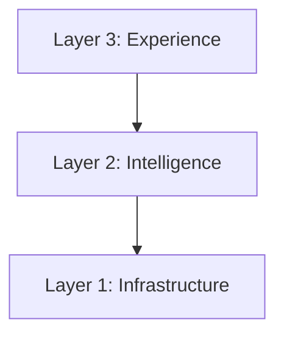

# Assets

Visual assets for the Strata documentation.

## Folder Structure

```
assets/
├── banner.png              # Main README hero (1280x640)
├── social-preview.png      # GitHub social card (1280x640)
├── logo.png                # Strata logo
│
├── screenshots/            # Dashboard screenshots
│   ├── dashboard.png       # Overview page
│   ├── pipeline.png        # Kanban view
│   ├── portfolio.png       # Systems table
│   ├── compliance.png      # EU AI Act + doc gen
│   ├── finops.png          # Cost tracking
│   └── reports.png         # Documents
│
├── diagrams/               # Architecture & concept diagrams
│   ├── three-layers.png    # Core framework visual
│   ├── ai-lifecycle.png    # Continuous iteration loop
│   ├── level-2-arch.png    # Static dashboard architecture
│   ├── level-3-arch.png    # + Firestore architecture
│   └── level-4-arch.png    # Full enterprise architecture
│
└── templates/              # Printable template versions
    ├── idea-canvas.pdf     # One-page AI opportunity canvas
    └── prioritisation.pdf  # Scoring matrix
```

## Specifications

### Banner & Social Preview
- **Dimensions:** 1280 x 640 pixels
- **Format:** PNG
- **Content:** "Strata" branding + tagline + abstract layer visual

### Screenshots
- **Dimensions:** 1200 x 800 pixels (or browser native)
- **Format:** PNG
- **Style:** Clean, no browser chrome, light mode

### Diagrams
- **Dimensions:** 800 x 600 pixels minimum
- **Format:** PNG (with transparent background if possible)
- **Style:** Clean, minimal, consistent color scheme

### Color Palette
| Color | Hex | Usage |
|-------|-----|-------|
| Primary Blue | #1e3a5f | Headers, primary elements |
| Accent Teal | #00a3a6 | Highlights, links |
| Success Green | #16a34a | Compliant, success states |
| Warning Amber | #f59e0b | Attention, warnings |
| Danger Red | #dc2626 | High risk, errors |
| Background | #f9fafb | Light backgrounds |
| Text | #111827 | Primary text |

## Creating Assets

### With Gemini Image Creator
Good for: Abstract visuals, banners, conceptual diagrams

### With NotebookLM
Good for: Summarizing content, generating diagram descriptions

### With Screenshots
1. Run dashboard locally: `cd dashboard && npm run dev`
2. Open each page
3. Use browser screenshot or tool like CleanShot
4. Crop to content area

### With Mermaid (Backup)
For diagrams that can render inline in GitHub markdown:

